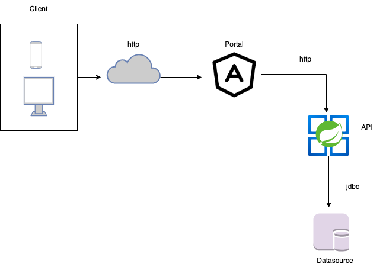

= Assignment
:toc:
:toclevels: 3
:toc-placement!:

toc::[]

== Overview
This project is an assignment to verify knowledge about enterprise application.

The chosen architecture is n tier architecture.



== Ho to test

Prerequisites:

```
maven 3.8.x
java 17
npm
docker-compose
docker
```

- Build the portal project base on ES5 and Angular 9
- Build the API project base on Java 17 and Spring Boot 3.1.0

Create deployment units

- *portal*: execute these commands:

```
cd portal/

npm i --force

npm run build:prod
```

- *backend*: execute these commands:

```
cd technical-assignment/

mvn clean install
```

- *run together*

```
cd bh-assignment/

docker-compose build

docker-compose up -d
```

- *verify that everything works*

Launch this url in your browser:

```
http://localhost/login

User: admin/admin

NB: click many times if the first click does not show something
```

API documentation:

```
http://localhost:8080/swagger-ui/index.html#/
```

How to generate token to test API ?

- *generate token*

```
curl 'http://localhost:8080/auth/login' \
--header 'Content-Type: application/json' \
--data '{
	"username":"admin",
	"password":"admin"
}'


{
    "access_token": "eyJhbGci...",
    "expired_at": 1687456636148,
    "token_type": "Bearer"
}
```

- *add access token to requests*

Click on Authorize key and add access token ton input file

== Ho to stop

Run this command to stop project

```
cd bh-assignment/

docker-compose down
```